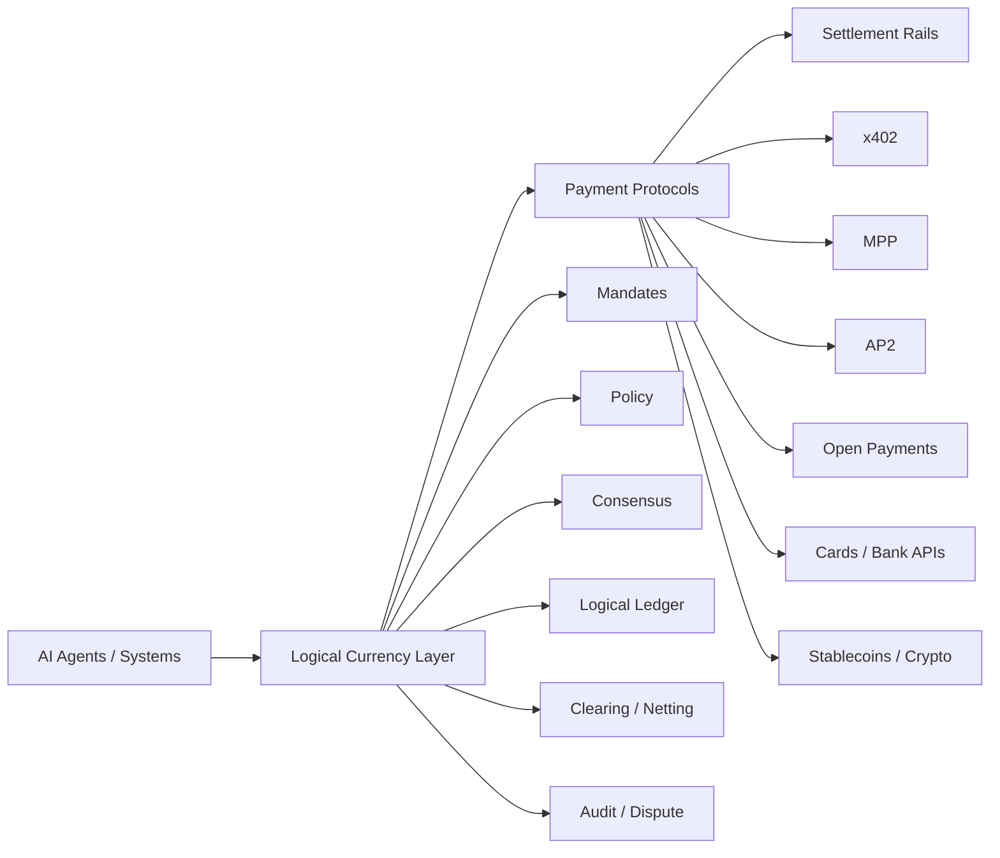
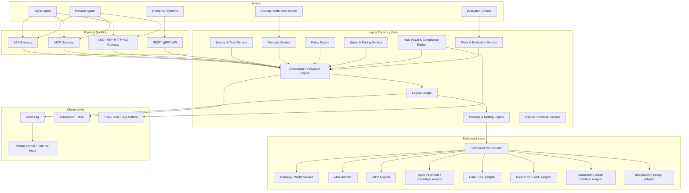
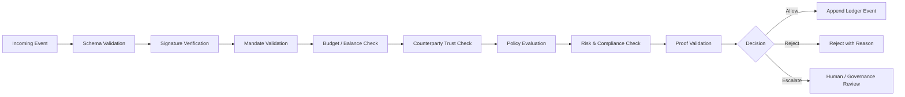
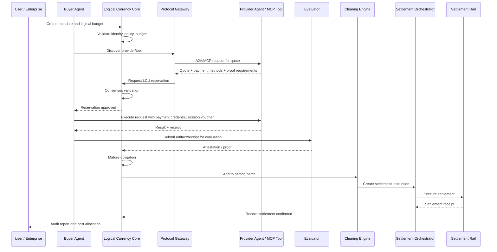
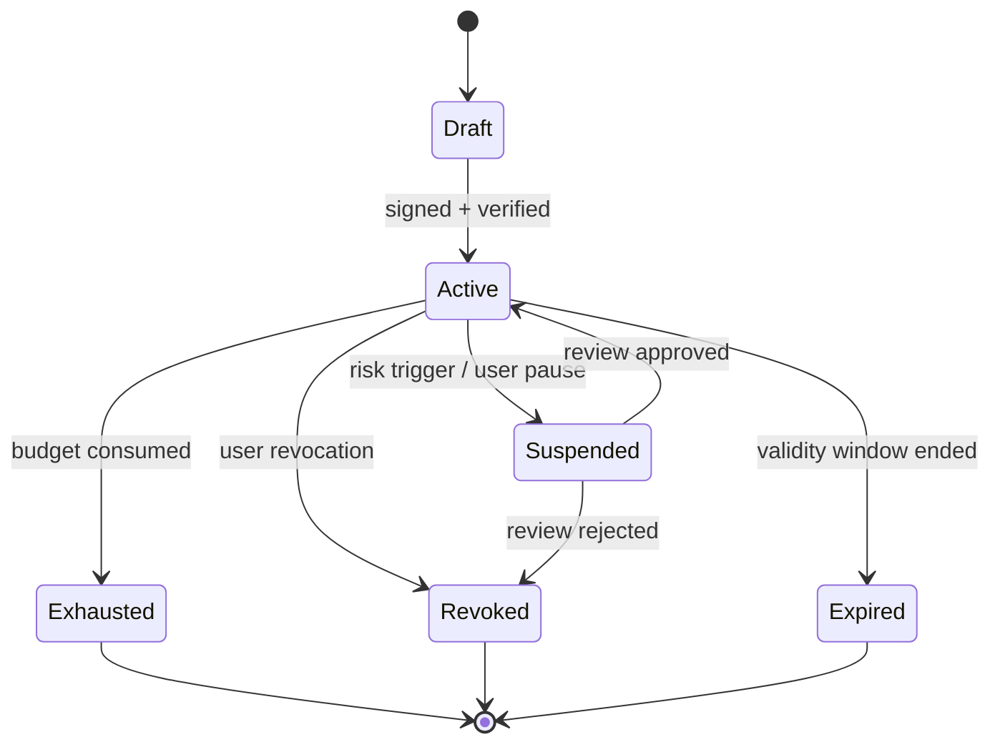
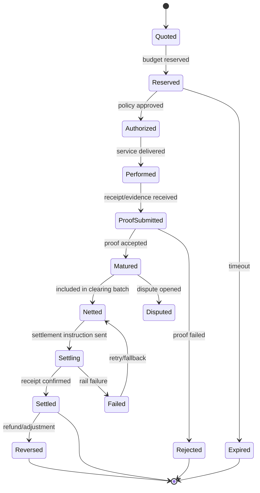
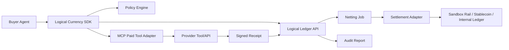

# Technical Reference Architecture for Logical Currency

## 1. Architecture stance

The best implementation path is to treat **logical currency** as a **machine-native economic coordination layer**, not as a new coin or settlement asset.

A logical currency unit should represent a **policy-bound, cryptographically signed, auditable economic state object**. It can reference dollars, stablecoins, compute credits, API credits, internal budget units, or other denominations, but it should not need to be the final money itself.

In practical terms:

> **Logical currency = delegated value + intent + policy + conditions + proof + clearing + settlement routing.**

It should sit between agent protocols and payment rails:



A2A can provide agent-to-agent communication, while MCP provides standardized agent-to-tool/resource access; AP2 is useful for verifiable payment authorization and mandates; x402 and MPP are useful for HTTP-native machine payments; Open Payments and Interledger are useful as cross-account or cross-ledger settlement patterns. A2A’s official documentation describes it as an open standard for communication and collaboration between agents, while MCP defines a standardized way for servers to expose resources to clients. ([A2A Protocol][1]) AP2 uses verifiable digital credentials and mandate objects to prove user intent and payment authorization, and x402 enables programmatic HTTP-native stablecoin payments through the HTTP 402 pattern. ([AP2 Protocol][2]) MPP generalizes the same HTTP 402 idea with challenge, credential, receipt, request binding, idempotency, and session-style payments using off-chain vouchers and periodic settlement. ([Privy][3])

---

## 2. Design goals

The reference architecture should satisfy these goals:

| Goal                      | Meaning                                                                                                                             |
| ------------------------- | ----------------------------------------------------------------------------------------------------------------------------------- |
| **Machine-native**        | Agents and systems can price, authorize, reserve, execute, verify, and settle without visual checkout flows.                        |
| **Policy-bound autonomy** | Every spend action is constrained by mandate, budget, counterparty, time, purpose, risk, and proof rules.                           |
| **Settlement-agnostic**   | The system can settle through stablecoins, cards, bank APIs, internal ledgers, Open Payments, Interledger, or future rails.         |
| **Net-first**             | High-frequency micro-events are recorded logically, then netted, batched, or compressed before settlement.                          |
| **Proof-driven**          | Payment can depend on service completion, data quality, SLA compliance, evaluator approval, or cryptographic proof.                 |
| **Auditable**             | Every obligation traces back to agent identity, user mandate, policy decision, service proof, and settlement receipt.               |
| **Composable**            | The architecture integrates with A2A, MCP, AP2, x402, MPP, ERC-style escrow, wallet infrastructure, and enterprise systems.         |
| **Regulation-aware**      | Actual custody and regulated money movement can be delegated to banks, PSPs, stablecoin issuers, custodians, or licensed providers. |

Non-goals:

| Non-goal                                     | Reason                                                            |
| -------------------------------------------- | ----------------------------------------------------------------- |
| **Do not start as a new public token**       | That creates unnecessary regulatory and market friction.          |
| **Do not force every event on-chain**        | Agent micro-transactions need very low latency and low cost.      |
| **Do not replace payment rails**             | Logical currency coordinates value; settlement rails move value.  |
| **Do not give agents unconstrained wallets** | Agents should receive narrow, revocable, policy-scoped authority. |

---

## 3. High-level reference architecture



---

## 4. Core architectural layers

### 4.1 Identity and trust layer

This layer identifies the actors participating in logical currency transactions.

Supported identities:

| Actor               | Identity form                                                          |
| ------------------- | ---------------------------------------------------------------------- |
| Human user          | User account, passkey, wallet, enterprise SSO identity                 |
| Organization        | Legal entity ID, enterprise tenant ID, KYB profile                     |
| Buyer agent         | Agent ID, owner, version, endpoint, public key, allowed tools          |
| Provider agent      | Agent ID, service catalog, endpoint, reputation, settlement address    |
| Evaluator           | Evaluator ID, attestation key, validation method, dispute role         |
| Settlement provider | PSP, bank, wallet provider, custodian, stablecoin rail, card processor |

Use **DIDs**, **W3C Verifiable Credentials**, or enterprise PKI for portable identity and signed claims. The W3C VC model defines tamper-secured claims involving issuers, holders, and verifiers, while DID documents can contain cryptographic material and service endpoints that allow a controller to prove control of an identifier. ([W3C][4])

Recommended identity object:

```json
{
  "agentId": "agent:acme:procurement:v3",
  "owner": "did:web:acme.example",
  "controller": "org:acme-corp",
  "publicKeys": [
    {
      "kid": "key-2026-05",
      "type": "Ed25519VerificationKey2020",
      "purpose": ["authentication", "capabilityInvocation", "receiptSigning"]
    }
  ],
  "endpoints": {
    "a2a": "https://agents.acme.example/a2a/procurement",
    "mcp": "https://agents.acme.example/mcp",
    "payment": "https://pay.acme.example/.well-known/logical-currency"
  },
  "trustProfile": {
    "kybStatus": "verified",
    "riskTier": "low",
    "reputationScore": 0.982,
    "lastReviewedAt": "2026-05-20T00:00:00Z"
  }
}
```

ERC-8004 is relevant as an optional public trust/discovery layer because it allows agents to advertise endpoints such as A2A cards, MCP endpoints, DIDs, and wallets, and it also defines reputation feedback structures. ([Ethereum Improvement Proposals][5])

---

### 4.2 Mandate and authorization layer

A mandate is the root authority for agent spending. It answers:

> Who authorized the agent, for what purpose, within what limits, against which counterparties, using which settlement methods, and requiring what proof?

This layer should be compatible with AP2-style mandates. AP2 defines checkout and payment mandates as verifiable digital credentials, with open and closed stages for constraints, finalized checkout details, and specific payment authorization. ([AP2 Protocol][2])

Recommended mandate types:

| Mandate type             | Purpose                                                                                            |
| ------------------------ | -------------------------------------------------------------------------------------------------- |
| **Intent Mandate**       | User or enterprise declares the goal: “optimize logistics,” “buy market data,” “purchase compute.” |
| **Budget Mandate**       | Defines spend caps, velocity limits, allowed denominations, expiry, and funding source.            |
| **Counterparty Mandate** | Defines who the agent may transact with.                                                           |
| **Settlement Mandate**   | Defines allowed rails: stablecoin, card, bank, internal ledger, x402, MPP, Open Payments.          |
| **Proof Mandate**        | Defines when an obligation matures into payable state.                                             |
| **Escalation Mandate**   | Defines when human review is required.                                                             |

Example mandate:

```json
{
  "type": "LogicalCurrencyMandate",
  "version": "lc/0.1",
  "mandateId": "mandate_01HX9K2...",
  "issuer": "did:web:acme.example",
  "holder": "agent:acme:procurement:v3",
  "subject": "project:logistics-optimization-2026-05-20",
  "validity": {
    "notBefore": "2026-05-20T00:00:00Z",
    "notAfter": "2026-05-21T00:00:00Z"
  },
  "budget": {
    "denomination": "USD",
    "totalCap": "5000.00",
    "perTransactionCap": "50.00",
    "perCounterpartyCap": "1000.00",
    "velocityLimit": {
      "amount": "500.00",
      "window": "PT1H"
    }
  },
  "allowedPurposes": [
    "route_optimization",
    "weather_api",
    "fuel_price_api",
    "carrier_quote"
  ],
  "counterpartyPolicy": {
    "allowList": ["org:trusted-carrier-network", "org:verified-data-vendors"],
    "minTrustScore": 0.92,
    "kybRequired": true
  },
  "proofPolicy": {
    "requiredProofs": ["service_receipt", "sla_attestation"],
    "evaluator": "agent:evaluator:acme:v1",
    "payOnlyIf": "proof.sla.latency_ms < 500 && proof.result.status == 'accepted'"
  },
  "settlementPolicy": {
    "mode": "net_batch",
    "interval": "PT30M",
    "allowedRails": ["internal_ledger", "usdc", "x402", "mpp"],
    "maxOpenExposure": "250.00"
  },
  "humanReview": {
    "requiredAbove": "500.00",
    "requiredForDisputes": true
  },
  "signature": {
    "alg": "EdDSA",
    "kid": "did:web:acme.example#key-2026-05",
    "value": "base64url-signature"
  }
}
```

---

### 4.3 Logical currency object layer

The core object should be called a **Logical Currency Unit**, or **LCU**, but its technical form should be closer to a **programmable obligation** than a coin.

An LCU may represent:

| LCU form                   | Meaning                                                        |
| -------------------------- | -------------------------------------------------------------- |
| **Reserved spend right**   | Budget capacity reserved for a potential transaction.          |
| **Conditional obligation** | Pay if a condition is satisfied.                               |
| **Matured payable**        | Proof has passed; payment is owed.                             |
| **Clearing unit**          | Nettable balance between parties.                              |
| **Settlement instruction** | A payable amount routed to a rail.                             |
| **Service credit**         | Redeemable unit for API, compute, storage, inference, or data. |

Recommended LCU structure:

```json
{
  "type": "LogicalCurrencyUnit",
  "version": "lc/0.1",
  "lcuId": "lcu_01HX9P4...",
  "parentMandateId": "mandate_01HX9K2...",
  "issuer": "did:web:acme.example",
  "debtor": "org:acme-corp",
  "creditor": "org:weather-data-provider",
  "buyerAgent": "agent:acme:procurement:v3",
  "providerAgent": "agent:weather:api:v2",
  "denomination": {
    "unit": "USD",
    "amount": "0.0042",
    "precision": 6
  },
  "backing": {
    "type": "enterprise_budget",
    "sourceRef": "erp:budget:ops-ai-2026"
  },
  "purpose": "weather_api",
  "state": "reserved",
  "conditions": [
    {
      "type": "service_receipt_required",
      "receiptType": "WeatherForecastReceipt"
    },
    {
      "type": "sla",
      "metric": "latency_ms",
      "operator": "<",
      "value": 500
    }
  ],
  "settlementPreference": {
    "mode": "net_batch",
    "rails": ["mpp", "x402", "internal_ledger", "usdc"],
    "settleAfter": "PT30M"
  },
  "idempotencyKey": "idem_9fd6a...",
  "trace": {
    "taskId": "task_route_optim_772",
    "quoteId": "quote_01HX9N...",
    "requestHash": "sha256:..."
  },
  "createdAt": "2026-05-20T17:32:10Z",
  "expiresAt": "2026-05-20T17:37:10Z",
  "signature": {
    "alg": "EdDSA",
    "kid": "agent:acme:procurement:v3#spend-key-1",
    "value": "base64url-signature"
  }
}
```

Important design choice: LCUs should usually be **non-transferable outside their mandate scope**. That reduces regulatory ambiguity and prevents the logical layer from becoming an uncontrolled bearer-money system.

---

## 5. Component reference

### 5.1 Agent wallet and authority manager

This component does not merely hold money. It holds **delegated authority**.

Responsibilities:

| Function        | Description                                                                                                   |
| --------------- | ------------------------------------------------------------------------------------------------------------- |
| Key management  | Agent signing keys, wallet keys, API credentials, passkeys, delegated credentials.                            |
| Spend authority | Mandate-bound authority, not unlimited wallet access.                                                         |
| Session funding | Pre-fund or authorize an MPP-style session, x402 payment, card authorization, or internal ledger reservation. |
| Human override  | Escalate above thresholds or on risky counterparties.                                                         |
| Revocation      | Revoke agent spend rights immediately.                                                                        |

Implementation notes:

* Use separate keys for identity, spend authorization, settlement signing, and receipt signing.
* Use hardware-backed KMS/HSM or secure enclave custody for production.
* Never expose raw settlement keys to the reasoning model.
* Model calls should request spend actions through a narrow “payment capability API.”

---

### 5.2 Protocol gateway

The protocol gateway normalizes external agent and payment protocols into internal logical currency events.

Supported gateway inputs:

| External interaction  | Internal event                     |
| --------------------- | ---------------------------------- |
| A2A task request      | `AgentTaskRequested`               |
| MCP tool call         | `ToolUsageRequested`               |
| x402 402 response     | `PaymentChallengeReceived`         |
| MPP challenge         | `PaymentChallengeReceived`         |
| AP2 mandate           | `MandatePresented`                 |
| Open Payments grant   | `SettlementAuthorizationPresented` |
| ERC-8183 escrow event | `ExternalEscrowEventReceived`      |

A2A and MCP should be treated as interaction protocols, not payment rails. x402 and MPP should be treated as payment-execution protocols. AP2 should be treated as an authorization and proof-of-intent protocol. Open Payments and Interledger should be treated as payment-instruction and cross-ledger settlement patterns. Open Payments separates payment instructions from execution and settlement, while Interledger’s architecture enables payments across multiple ledger types with in-flight balances and periodic settlement. ([Open Payments][6])

---

### 5.3 Policy engine

The policy engine decides whether a proposed logical transaction is allowed.

Policy inputs:

| Input             | Example                                      |
| ----------------- | -------------------------------------------- |
| Mandate           | “Agent may spend up to $5,000 today.”        |
| Purpose           | “Fuel price API for logistics optimization.” |
| Counterparty      | “Verified provider with trust score 0.97.”   |
| Price             | “$0.0042 per call.”                          |
| Risk              | “Low risk, known counterparty.”              |
| Context           | “Task belongs to approved project.”          |
| Settlement rail   | “MPP session or internal ledger preferred.”  |
| Proof requirement | “Must return signed receipt and SLA proof.”  |

Example policy rule:

```rego
package logical_currency.spend

default allow := false

allow {
  input.mandate.status == "active"
  input.amount <= input.mandate.budget.perTransactionCap
  input.counterparty.trustScore >= input.mandate.counterpartyPolicy.minTrustScore
  input.purpose in input.mandate.allowedPurposes
  input.rail in input.mandate.settlementPolicy.allowedRails
  not input.risk.sanctionsHit
  not input.risk.promptInjectionDetected
}
```

The policy engine should emit a signed decision object:

```json
{
  "decisionId": "decision_01HX9R...",
  "inputHash": "sha256:...",
  "decision": "allow",
  "rulesEvaluated": [
    "mandate.active",
    "budget.per_transaction_cap",
    "counterparty.trust_score",
    "purpose.allowed",
    "rail.allowed",
    "risk.no_sanctions_hit"
  ],
  "obligations": [
    "require_service_receipt",
    "require_sla_attestation",
    "net_before_settlement"
  ],
  "signedAt": "2026-05-20T17:32:11Z",
  "signature": "base64url-signature"
}
```

---

### 5.4 Consensus and validation engine

The consensus engine is the heart of logical currency. It validates state transitions before they hit the ledger.

It should enforce these invariants:

| Invariant                  | Rule                                                                                       |
| -------------------------- | ------------------------------------------------------------------------------------------ |
| **No overspend**           | Reserved + matured + settled obligations cannot exceed mandate limits.                     |
| **No replay**              | Each request hash, quote ID, and idempotency key can be consumed only according to policy. |
| **No unscoped spend**      | Every LCU must map to an active mandate and allowed purpose.                               |
| **No fake counterparty**   | Provider identity, endpoint, and settlement address must verify.                           |
| **No proofless maturity**  | Conditional obligations cannot mature without required proof.                              |
| **No settlement mismatch** | Settlement amount, rail, recipient, and receipt must match matured obligations.            |
| **No hidden mutation**     | Every state transition must preserve prior state hash and audit linkage.                   |

Consensus does not have to mean public blockchain consensus. It means **deterministic agreement on valid economic state**.

Recommended deployment modes:

| Mode                         | Use case                                            | Implementation                                                        |
| ---------------------------- | --------------------------------------------------- | --------------------------------------------------------------------- |
| **Single-domain enterprise** | One company managing internal agents                | PostgreSQL serializable ledger + append-only event log                |
| **Multi-party consortium**   | Network of enterprises/providers                    | Permissioned validators, BFT/Raft-style consensus, shared audit roots |
| **Public-verifiable hybrid** | Need public auditability, not full public execution | Off-chain ledger with Merkle roots anchored on-chain                  |
| **On-chain escrow mode**     | Trust-minimized job marketplace                     | Smart contracts for escrow, evaluator attestation, and settlement     |

ERC-8183 is a useful reference for the on-chain escrow mode because it defines job escrow with evaluator attestation for agent commerce. ([Ethereum Improvement Proposals][7])

Consensus validation flow:



---

### 5.5 Logical ledger

The logical ledger stores economic state before final money movement.

It should be:

* **Append-only** for auditability.
* **Event-sourced** for reconstructing state.
* **Hash-chained** for tamper evidence.
* **Idempotent** for safe retries.
* **Partitionable** by tenant, mandate, counterparty, and settlement rail.
* **Queryable** for balances, obligations, proofs, disputes, and settlements.

Ledger event examples:

| Event                 | Meaning                                                                |
| --------------------- | ---------------------------------------------------------------------- |
| `MandateCreated`      | User or enterprise created spend authority.                            |
| `BudgetIssued`        | Logical budget became available.                                       |
| `QuoteReceived`       | Provider offered price and terms.                                      |
| `LCUReserved`         | Budget reserved for a potential obligation.                            |
| `ServicePerformed`    | Provider claims service was completed.                                 |
| `ProofSubmitted`      | Receipt, SLA proof, evaluator attestation, or artifact hash submitted. |
| `ObligationMatured`   | Conditional LCU became payable.                                        |
| `ObligationRejected`  | Proof failed or policy rejected.                                       |
| `ObligationsNetted`   | Multiple payables compressed into a net amount.                        |
| `SettlementInitiated` | Payment instruction sent to a rail.                                    |
| `SettlementConfirmed` | External rail receipt confirmed.                                       |
| `DisputeOpened`       | A party challenged the obligation.                                     |
| `ReversalPosted`      | Adjustment or refund applied.                                          |

Recommended event structure:

```json
{
  "eventId": "evt_01HX9S...",
  "eventType": "LCUReserved",
  "tenantId": "tenant_acme",
  "occurredAt": "2026-05-20T17:32:12Z",
  "actor": "agent:acme:procurement:v3",
  "mandateId": "mandate_01HX9K2...",
  "lcuId": "lcu_01HX9P4...",
  "amount": {
    "unit": "USD",
    "value": "0.0042"
  },
  "stateBeforeHash": "sha256:...",
  "stateAfterHash": "sha256:...",
  "causationId": "decision_01HX9R...",
  "correlationId": "task_route_optim_772",
  "idempotencyKey": "idem_9fd6a...",
  "payloadHash": "sha256:...",
  "signature": "base64url-signature"
}
```

---

### 5.6 Clearing and netting engine

The clearing engine reduces settlement events.

Instead of settling every micro-action, the system groups matured obligations by:

| Netting dimension        | Example                                   |
| ------------------------ | ----------------------------------------- |
| Debtor                   | Acme Corp                                 |
| Creditor                 | Weather API Provider                      |
| Denomination             | USD                                       |
| Settlement rail          | USDC, internal ledger, card, bank, MPP    |
| Time window              | 30 minutes                                |
| Risk bucket              | Low-risk, pre-approved, disputed          |
| Mandate                  | Project-specific budget                   |
| Tax/accounting treatment | Department, cost center, invoice category |

Netting example:

| Event type             |  Count |       Gross |
| ---------------------- | -----: | ----------: |
| Weather API calls      | 42,000 |     $176.40 |
| Fuel API calls         |  8,000 |      $96.00 |
| Carrier quote calls    |  1,200 |     $240.00 |
| Rejected/failed proofs |    900 |     -$12.60 |
| **Net settlement**     |      — | **$499.80** |

The clearing engine then creates a `SettlementBatch`:

```json
{
  "batchId": "batch_01HX9Z...",
  "debtor": "org:acme-corp",
  "creditor": "org:weather-data-provider",
  "currency": "USD",
  "grossAmount": "512.40",
  "adjustments": "-12.60",
  "netAmount": "499.80",
  "obligationCount": 51200,
  "settlementRail": "usdc",
  "settlementDeadline": "2026-05-20T18:05:00Z",
  "includedObligationsMerkleRoot": "sha256:...",
  "status": "ready_for_settlement"
}
```

This is where logical currency becomes meaningfully different from simple payment protocols: it treats payments as **economic state transitions** that can be reserved, matured, netted, disputed, and settled.

---

### 5.7 Settlement orchestrator

The settlement orchestrator converts matured, netted obligations into actual payment instructions.

Supported settlement adapters:

| Adapter                   | Use case                                                                         |
| ------------------------- | -------------------------------------------------------------------------------- |
| **Internal ledger**       | Same enterprise, same platform, no external money movement.                      |
| **Stablecoin**            | Fast cross-border settlement, programmable wallets, x402, MPP, smart contracts.  |
| **Card/PSP**              | Merchant acceptance, buyer protections, refunds, fraud tooling.                  |
| **Bank API**              | ACH, RTP, FedNow-like rails, SEPA, PIX, UPI, local payment networks.             |
| **Open Payments**         | Standardized account-to-account instructions through account-servicing entities. |
| **Interledger**           | Cross-ledger payment routing and ledger interoperability.                        |
| **Smart contract escrow** | Trust-minimized conditional work settlement.                                     |

Open Payments explicitly separates payment instructions from actual execution and settlement by account-servicing entities, which is useful for keeping logical currency as an orchestration layer rather than a custodian. ([Open Payments][6])

Settlement instruction:

```json
{
  "settlementInstructionId": "setinst_01HXA1...",
  "batchId": "batch_01HX9Z...",
  "debtor": "org:acme-corp",
  "creditor": "org:weather-data-provider",
  "amount": {
    "currency": "USD",
    "value": "499.80"
  },
  "rail": "usdc",
  "source": {
    "type": "custodial_wallet",
    "walletRef": "wallet_acme_ops"
  },
  "destination": {
    "type": "wallet_address",
    "addressRef": "provider_settlement_wallet"
  },
  "executionPolicy": {
    "maxFee": "0.50",
    "deadline": "2026-05-20T18:05:00Z",
    "retryPolicy": "exponential_backoff",
    "fallbackRails": ["bank_rtp", "card_psp"]
  },
  "audit": {
    "includedObligationsMerkleRoot": "sha256:...",
    "policyDecisionRoot": "sha256:..."
  }
}
```

---

## 6. End-to-end transaction lifecycle

### Scenario

A buyer agent needs to call a paid MCP tool that provides market data. The provider supports MPP session payments and x402 one-time payments. The enterprise prefers net settlement every 30 minutes.



Lifecycle stages:

| Stage                          | Description                                                                      |
| ------------------------------ | -------------------------------------------------------------------------------- |
| **1. Mandate issuance**        | Human or enterprise grants agent scoped authority.                               |
| **2. Logical budget issuance** | Budget is created but not necessarily funded externally yet.                     |
| **3. Discovery**               | Agent discovers provider through A2A, MCP, registry, catalog, or API.            |
| **4. Quote**                   | Provider returns price, SLA, payment methods, proof requirements.                |
| **5. Reservation**             | Logical currency core reserves budget capacity.                                  |
| **6. Execution**               | Agent consumes service or delegates task.                                        |
| **7. Proof**                   | Provider or evaluator submits receipt, artifact hash, SLA proof, or attestation. |
| **8. Maturity**                | Conditional obligation becomes payable.                                          |
| **9. Netting**                 | Matured obligations are grouped and compressed.                                  |
| **10. Settlement**             | Actual rail moves value or posts internal ledger entry.                          |
| **11. Audit**                  | User, enterprise, provider, or regulator can inspect signed trace.               |

---

## 7. State machines

### 7.1 Mandate state machine



### 7.2 Logical currency unit state machine



---

## 8. API reference surface

A production system should expose both **control-plane APIs** and **transaction-plane APIs**.

### 8.1 Control-plane APIs

| API                             | Purpose                                              |
| ------------------------------- | ---------------------------------------------------- |
| `POST /v1/agents/register`      | Register agent identity, endpoints, keys, owner.     |
| `POST /v1/mandates`             | Create mandate.                                      |
| `POST /v1/mandates/{id}/revoke` | Revoke mandate.                                      |
| `POST /v1/budgets`              | Issue logical budget under mandate.                  |
| `GET /v1/budgets/{id}/balance`  | Read available, reserved, matured, settled balances. |
| `POST /v1/policies/evaluate`    | Dry-run policy decision.                             |
| `GET /v1/audit/{correlationId}` | Retrieve trace and proof bundle.                     |

### 8.2 Transaction-plane APIs

| API                           | Purpose                                           |
| ----------------------------- | ------------------------------------------------- |
| `POST /v1/quotes`             | Request or normalize quote.                       |
| `POST /v1/lcus/reserve`       | Reserve logical currency.                         |
| `POST /v1/lcus/commit`        | Commit reservation after service acceptance.      |
| `POST /v1/proofs`             | Submit proof, receipt, or evaluator attestation.  |
| `POST /v1/obligations/mature` | Mature payable obligation after proof validation. |
| `POST /v1/clearing/batches`   | Create or close netting batch.                    |
| `POST /v1/settlements`        | Initiate settlement.                              |
| `POST /v1/disputes`           | Open dispute.                                     |
| `POST /v1/reversals`          | Post reversal or adjustment.                      |

Example reservation request:

```json
{
  "mandateId": "mandate_01HX9K2...",
  "buyerAgent": "agent:acme:procurement:v3",
  "provider": "org:market-data-provider",
  "purpose": "market_data_api",
  "quote": {
    "quoteId": "quote_01HXB...",
    "amount": "0.015",
    "currency": "USD",
    "expiresAt": "2026-05-20T17:35:00Z",
    "paymentMethods": ["mpp", "x402", "usdc"]
  },
  "request": {
    "method": "POST",
    "resource": "mcp://market-data-provider/tools/get-price-history",
    "bodyHash": "sha256:..."
  },
  "idempotencyKey": "idem_01HXB..."
}
```

Example reservation response:

```json
{
  "decision": "approved",
  "lcuId": "lcu_01HXC...",
  "reservedAmount": {
    "currency": "USD",
    "value": "0.015"
  },
  "expiresAt": "2026-05-20T17:35:00Z",
  "requiredProofs": ["service_receipt", "response_hash"],
  "preferredPaymentFlow": {
    "method": "mpp",
    "mode": "session_voucher"
  },
  "policyDecisionId": "decision_01HXD..."
}
```

---

## 9. Integration adapters

### 9.1 A2A adapter

Use A2A for:

* agent discovery,
* task negotiation,
* capability exchange,
* quote exchange,
* provider selection,
* multi-agent work delegation.

The logical currency layer should attach payment and mandate metadata to A2A task messages without requiring provider agents to know the full internal policy system.

Internal mapping:

| A2A concept           | Logical currency concept                       |
| --------------------- | ---------------------------------------------- |
| Agent card / endpoint | Counterparty identity profile                  |
| Task                  | Economic task context                          |
| Message               | Quote, proof, receipt, or negotiation artifact |
| Artifact              | Deliverable hash or proof input                |
| Agent capability      | Allowed purpose / billable service             |

---

### 9.2 MCP adapter

Use MCP for paid tools and resources.

Internal mapping:

| MCP concept          | Logical currency concept       |
| -------------------- | ------------------------------ |
| Resource URI         | Billable resource              |
| Tool call            | Metered event                  |
| Tool result          | Service artifact               |
| Server metadata      | Pricing and proof policy       |
| Client authorization | Mandate-bound agent permission |

MCP’s resource model is useful because resources are identified by URIs and can represent files, database schemas, or application-specific information exposed to model clients. ([Model Context Protocol][8])

---

### 9.3 AP2 adapter

Use AP2 for:

* user intent capture,
* checkout/payment mandates,
* verifiable payment authorization,
* audit trail alignment with payment providers,
* human-present and human-not-present flows.

Mapping:

| AP2 object              | Logical currency object               |
| ----------------------- | ------------------------------------- |
| Open Checkout Mandate   | Intent Mandate                        |
| Closed Checkout Mandate | Finalized service/order authorization |
| Open Payment Mandate    | Budget/settlement mandate             |
| Closed Payment Mandate  | Specific settlement authorization     |
| VDC chain               | Audit chain                           |

The AP2 adapter should accept AP2 mandates, translate them into logical currency mandates, and preserve the original credential chain for dispute and audit.

---

### 9.4 x402 adapter

Use x402 for simple, discrete HTTP-native payments.

Flow:

1. Agent requests resource.
2. Server returns HTTP 402 with payment requirement.
3. Logical currency core evaluates mandate and budget.
4. Agent wallet signs or funds payment.
5. Agent retries request with payment payload.
6. Provider returns resource and receipt.
7. Logical ledger records external receipt.

x402 is especially appropriate for one-off paid API calls or content access where immediate payment is acceptable. Coinbase’s documentation describes x402 as an HTTP 402-based protocol for instant, automatic stablecoin payments by human or machine clients without complex accounts or manual payment flows. ([Coinbase Developer Docs][9])

---

### 9.5 MPP adapter

Use MPP for high-frequency, low-value, session-oriented agent transactions.

Recommended mapping:

| MPP primitive  | Logical currency concept              |
| -------------- | ------------------------------------- |
| Challenge      | Quote/payment requirement             |
| Credential     | Payment proof or voucher              |
| Receipt        | Settlement or delivery receipt        |
| Charge intent  | One-time LCU settlement               |
| Session intent | Budget-backed logical payment channel |

MPP is highly aligned with logical currency because it supports payment-method-agnostic machine payments, request binding, idempotency, expiration, and continuous session payments. Privy’s MPP summary describes sessions as allowing funds to be locked up front, signed vouchers issued off-chain as services are consumed, and settlement performed periodically. ([Privy][3])

---

### 9.6 ERC-8183 / escrow adapter

Use an ERC-8183-style adapter when work requires escrow and evaluator attestation.

Best use cases:

* “Pay if task is completed.”
* “Pay if evaluator approves.”
* “Pay if model output passes tests.”
* “Pay if artifact hash matches expected result.”
* “Refund if provider misses deadline.”

Mapping:

| ERC-8183 concept     | Logical currency concept           |
| -------------------- | ---------------------------------- |
| Client               | Buyer / debtor                     |
| Provider             | Seller / creditor                  |
| Evaluator            | Proof service                      |
| Job escrow           | Reserved LCU or external escrow    |
| Attestation          | ProofSubmitted / ObligationMatured |
| Completion/rejection | Matured or rejected obligation     |

---

## 10. Proof and evaluation architecture

Logical currency requires a proof layer because not every transaction should be paid merely because it was requested.

Proof types:

| Proof type                | Example                                               |
| ------------------------- | ----------------------------------------------------- |
| **Delivery receipt**      | Provider signed response hash.                        |
| **SLA proof**             | Latency, uptime, freshness, accuracy, token count.    |
| **Evaluator attestation** | Independent agent says result passed.                 |
| **Human approval**        | Manager approves high-value transaction.              |
| **TEE attestation**       | Service ran inside trusted execution environment.     |
| **zk proof**              | A constraint was satisfied without exposing raw data. |
| **Oracle proof**          | External event occurred.                              |
| **Reputation proof**      | Counterparty has acceptable historical performance.   |

Proof object:

```json
{
  "proofId": "proof_01HXF...",
  "lcuId": "lcu_01HXC...",
  "type": "sla_attestation",
  "submittedBy": "agent:market-data-provider:v2",
  "evaluatedBy": "agent:evaluator:acme:v1",
  "claims": {
    "status": "accepted",
    "latencyMs": 183,
    "responseHash": "sha256:...",
    "freshnessSeconds": 12
  },
  "verdict": "pass",
  "confidence": 0.997,
  "signedAt": "2026-05-20T17:32:18Z",
  "signature": "base64url-signature"
}
```

The evaluator should never be blindly trusted. It should itself have identity, reputation, conflict-of-interest rules, and, for high-value claims, multi-evaluator quorum or human escalation.

---

## 11. Risk, fraud, and compliance architecture

Logical currency must treat agents as financial attack surfaces.

### Key threats

| Threat                                     | Mitigation                                                                                    |
| ------------------------------------------ | --------------------------------------------------------------------------------------------- |
| Prompt injection causes unauthorized spend | Tool isolation, policy engine outside model, allowlisted purposes, human approval thresholds. |
| Fake provider agent                        | Verified endpoint, signed agent identity, registry lookup, domain verification.               |
| Replay attack                              | Idempotency keys, request-body hash binding, nonce, expiry.                                   |
| Overspend / double-spend                   | Atomic ledger reservation, serializable state transitions, budget locks.                      |
| Quote tampering                            | Signed quote, quote hash bound to reservation.                                                |
| Provider underdelivery                     | Proof requirement, evaluator attestation, dispute/reversal.                                   |
| Colluding provider and evaluator           | Evaluator independence, quorum, random audit, reputation penalties.                           |
| Wallet key compromise                      | Key isolation, transaction simulation, velocity limits, rapid revocation.                     |
| Sybil reputation                           | KYB, stake, historical volume weighting, graph analysis.                                      |
| Sensitive data leakage                     | Minimal disclosure, selective credentials, encrypted artifacts, privacy-preserving proofs.    |

### Compliance placement

The logical currency core should not need to be the regulated entity for all flows. A cleaner architecture separates:

| Layer                        | Responsibility                                                                          |
| ---------------------------- | --------------------------------------------------------------------------------------- |
| Logical currency core        | Intent, policy, ledger, clearing, proof, audit.                                         |
| Regulated settlement partner | Custody, money movement, card acquiring, bank transfer, stablecoin issuance/redemption. |
| Compliance service           | KYC/KYB, sanctions screening, transaction monitoring, tax reporting.                    |
| Enterprise system            | Budget ownership, cost centers, procurement policy, vendor approval.                    |

The exact boundary depends on jurisdiction and product design, but technically the logical layer should be able to operate as a **payment instruction and obligation layer** while regulated providers execute actual money movement.

---

## 12. Ledger and storage design

Recommended storage components:

| Store                      | Purpose                                                         |
| -------------------------- | --------------------------------------------------------------- |
| Relational ledger database | Balances, mandates, LCU states, settlement batches.             |
| Append-only event log      | Immutable transaction history.                                  |
| Object store               | Receipts, artifacts, proof payloads, signed credential bundles. |
| Graph database             | Agent relationships, trust network, reputation, ownership.      |
| Policy store               | Versioned policies and rules.                                   |
| Secrets/KMS/HSM            | Signing keys, wallet keys, service credentials.                 |
| Analytics warehouse        | Cost, fraud, SLA, optimization, reporting.                      |
| Merkle anchor store        | Periodic audit roots for tamper evidence.                       |

Ledger tables:

```sql
-- Simplified illustration only

CREATE TABLE mandates (
  mandate_id TEXT PRIMARY KEY,
  issuer TEXT NOT NULL,
  holder TEXT NOT NULL,
  status TEXT NOT NULL,
  valid_from TIMESTAMPTZ NOT NULL,
  valid_until TIMESTAMPTZ NOT NULL,
  policy_json JSONB NOT NULL,
  signature TEXT NOT NULL,
  created_at TIMESTAMPTZ NOT NULL DEFAULT now()
);

CREATE TABLE logical_currency_units (
  lcu_id TEXT PRIMARY KEY,
  mandate_id TEXT NOT NULL REFERENCES mandates(mandate_id),
  debtor TEXT NOT NULL,
  creditor TEXT,
  amount NUMERIC(38, 12) NOT NULL,
  currency TEXT NOT NULL,
  state TEXT NOT NULL,
  purpose TEXT NOT NULL,
  idempotency_key TEXT NOT NULL,
  request_hash TEXT,
  quote_hash TEXT,
  proof_hash TEXT,
  settlement_batch_id TEXT,
  created_at TIMESTAMPTZ NOT NULL DEFAULT now(),
  expires_at TIMESTAMPTZ,
  UNIQUE (mandate_id, idempotency_key)
);

CREATE TABLE ledger_events (
  event_id TEXT PRIMARY KEY,
  event_type TEXT NOT NULL,
  lcu_id TEXT,
  mandate_id TEXT,
  causation_id TEXT,
  correlation_id TEXT,
  state_before_hash TEXT,
  state_after_hash TEXT,
  payload_hash TEXT NOT NULL,
  signature TEXT NOT NULL,
  occurred_at TIMESTAMPTZ NOT NULL
);

CREATE TABLE settlement_batches (
  batch_id TEXT PRIMARY KEY,
  debtor TEXT NOT NULL,
  creditor TEXT NOT NULL,
  currency TEXT NOT NULL,
  gross_amount NUMERIC(38, 12) NOT NULL,
  net_amount NUMERIC(38, 12) NOT NULL,
  obligation_count INTEGER NOT NULL,
  merkle_root TEXT NOT NULL,
  rail TEXT NOT NULL,
  status TEXT NOT NULL,
  created_at TIMESTAMPTZ NOT NULL DEFAULT now()
);
```

Critical database requirements:

* Use serializable transactions for budget reservation.
* Enforce unique idempotency keys.
* Use immutable event rows; corrections happen through adjustment events.
* Keep monetary precision as decimal, never floating point.
* Maintain independent signed event hashes.
* Separate tenant data for enterprise deployments.

---

## 13. Clearing algorithm

A basic netting algorithm:

```python
def build_settlement_batches(matured_obligations):
    groups = group_by(
        matured_obligations,
        keys=[
            "debtor",
            "creditor",
            "currency",
            "preferred_rail",
            "risk_bucket",
            "tax_category"
        ]
    )

    batches = []

    for key, obligations in groups.items():
        eligible = [
            o for o in obligations
            if not o.disputed
            and o.proof_status == "accepted"
            and o.settlement_deadline <= now()
        ]

        gross = sum(o.amount for o in eligible)
        adjustments = sum(o.adjustment for o in eligible)
        net = gross + adjustments

        if net <= 0:
            continue

        batch = SettlementBatch(
            debtor=key.debtor,
            creditor=key.creditor,
            currency=key.currency,
            rail=key.preferred_rail,
            obligations=eligible,
            gross_amount=gross,
            net_amount=net,
            merkle_root=merkle_root([o.hash for o in eligible])
        )

        batches.append(batch)

    return batches
```

Production versions should include:

* minimum settlement thresholds,
* maximum open exposure,
* settlement deadlines,
* provider-specific terms,
* rail fees,
* FX conversion,
* failed-settlement retry,
* tax/accounting grouping,
* dispute holdbacks,
* reserves for reversals.

---

## 14. Recommended MVP architecture

The first implementation should be narrow.

### MVP use case

> An enterprise AI agent can buy paid API/tool access from approved providers using a logical budget, record conditional obligations, and settle periodically.

### MVP stack

| Area                | Recommended MVP choice                                                      |
| ------------------- | --------------------------------------------------------------------------- |
| Identity            | Enterprise SSO + service keys; optional DID/VC wrapper.                     |
| Mandates            | Signed JSON mandate object.                                                 |
| Policy              | OPA/Rego or Cedar-style policy engine.                                      |
| Ledger              | PostgreSQL with serializable transactions.                                  |
| Event log           | Kafka, Redpanda, NATS, or append-only database table.                       |
| Agent integration   | MCP tool-payment adapter plus REST API.                                     |
| Payment integration | x402 for one-off payments; MPP session adapter where available.             |
| Settlement          | Stablecoin testnet, Stripe-like PSP sandbox, or internal ledger simulation. |
| Proof               | Signed provider receipt + response hash.                                    |
| Audit               | Hash-chained event log and downloadable trace bundle.                       |

### MVP components



### MVP scope boundaries

Include:

* mandate creation,
* budget issuance,
* provider allowlist,
* quote normalization,
* LCU reservation,
* service receipt,
* obligation maturity,
* net settlement batch,
* external settlement receipt,
* audit report.

Exclude initially:

* open public agent marketplace,
* fully decentralized consensus,
* complex FX,
* unsecured credit,
* public token issuance,
* autonomous dispute arbitration,
* unrestricted agent wallets.

---

## 15. Production hardening roadmap

### Phase 1 — Single-enterprise control plane

Deliver:

* enterprise mandate service,
* internal logical ledger,
* paid MCP/x402/MPP adapters,
* policy-bound agent spending,
* audit dashboard.

### Phase 2 — Provider network

Add:

* provider registration,
* trust scores,
* signed service catalogs,
* quote marketplace,
* settlement batches,
* SLA-based proof.

### Phase 3 — Multi-party clearing

Add:

* bilateral and multilateral netting,
* settlement risk limits,
* reserve accounts,
* rail optimization,
* credit exposure management.

### Phase 4 — Verifiable network

Add:

* verifiable credentials,
* DID-based identities,
* Merkle audit anchors,
* optional public registry,
* optional on-chain escrow for high-risk work.

### Phase 5 — Autonomous economic network

Add:

* dynamic pricing,
* machine-negotiated contracts,
* proof markets,
* evaluator networks,
* programmable insurance,
* cross-rail liquidity routing.

---

## 16. Reference implementation modules

A clean codebase could be organized like this:

```text
logical-currency/
  core/
    ledger/
    state-machine/
    consensus/
    clearing/
    settlement/
    proof/
    dispute/
  identity/
    did/
    vc/
    enterprise-sso/
    agent-registry/
  policy/
    schemas/
    rules/
    evaluators/
  protocols/
    a2a-adapter/
    mcp-adapter/
    ap2-adapter/
    x402-adapter/
    mpp-adapter/
    open-payments-adapter/
    erc8183-adapter/
  wallet/
    kms/
    custody/
    session-wallets/
    spend-controls/
  api/
    rest/
    grpc/
    webhooks/
  sdk/
    python/
    typescript/
    go/
  observability/
    audit/
    traces/
    metrics/
    merkle-anchors/
  examples/
    paid-mcp-tool/
    agent-to-agent-service/
    api-micropayments/
    net-settlement-demo/
```

---

## 17. Minimal SDK interface

A buyer agent should not know payment complexity. It should call a small SDK.

```python
from logical_currency import LogicalCurrencyClient

lc = LogicalCurrencyClient(agent_id="agent:acme:procurement:v3")

mandate = lc.get_active_mandate(
    purpose="market_data_api",
    project="logistics-optimization"
)

quote = lc.request_quote(
    provider="org:market-data-provider",
    resource="mcp://market-data-provider/tools/get-price-history",
    params={"symbol": "FUEL_INDEX"}
)

reservation = lc.reserve(
    mandate_id=mandate.id,
    quote_id=quote.id,
    purpose="market_data_api",
    idempotency_key="task-772-market-data-1"
)

result = lc.call_paid_tool(
    reservation_id=reservation.id,
    resource=quote.resource,
    params={"symbol": "FUEL_INDEX"},
    preferred_payment_mode="session"
)

proof = lc.submit_proof(
    reservation_id=reservation.id,
    receipt=result.receipt,
    artifact_hash=result.hash
)

lc.commit_if_proven(reservation.id)
```

The agent sees a simple “reserve, call, prove, commit” flow. The logical currency core handles policy, rail selection, proof validation, clearing, and settlement.

---

## 18. Key architectural decisions

### Decision 1: LCU as obligation, not bearer token

Do not make the LCU freely transferable by default. Make it a scoped economic object tied to mandate, purpose, counterparty, and expiry.

### Decision 2: Mandate-first spending

Every transaction must trace back to a signed mandate. No mandate, no spend.

### Decision 3: Ledger before settlement

Record logical state first. Move money only after maturity, netting, and risk checks.

### Decision 4: Proof before payable

For service-based commerce, request completion is not enough. Payment should mature only after required proof.

### Decision 5: Rail abstraction

Settlement rails should be adapters. x402, MPP, cards, banks, stablecoins, Open Payments, and Interledger are all execution options, not the logical currency core.

### Decision 6: Off-chain first, on-chain when needed

Use off-chain event sourcing for speed. Use on-chain settlement, escrow, or audit anchoring only when the trust model requires it.

### Decision 7: Policy outside the model

The AI model can propose a transaction. The policy and consensus engine must approve it independently.

---

## 19. One-sentence architecture summary

**Logical currency should be implemented as an agent-native obligation, clearing, and settlement-control plane: mandates grant scoped authority, agents create conditional logical currency units, a consensus engine validates policy and proof, a ledger records economic state, a clearing engine nets obligations, and settlement adapters move real value through existing rails.**

[1]: https://a2a-protocol.org/latest/ "A2A Protocol"
[2]: https://ap2-protocol.org/ "AP2 - Agent Payments Protocol Documentation"
[3]: https://privy.io/blog/building-on-privy-with-tempo-machine-payments-protocol "Privy Blog | Building on Privy with Tempo’s Machine Payments Protocol (MPP)"
[4]: https://www.w3.org/TR/vc-data-model-2.0/ "Verifiable Credentials Data Model v2.0"
[5]: https://eips.ethereum.org/EIPS/eip-8004 "ERC-8004: Trustless Agents"
[6]: https://openpayments.dev/overview/getting-started/ "Getting started | Open Payments"
[7]: https://eips.ethereum.org/EIPS/eip-8183 "ERC-8183: Agentic Commerce"
[8]: https://modelcontextprotocol.io/specification/2025-06-18/server/resources "Resources - Model Context Protocol"
[9]: https://docs.cdp.coinbase.com/x402/welcome "Welcome to x402 - Coinbase Developer Documentation"
